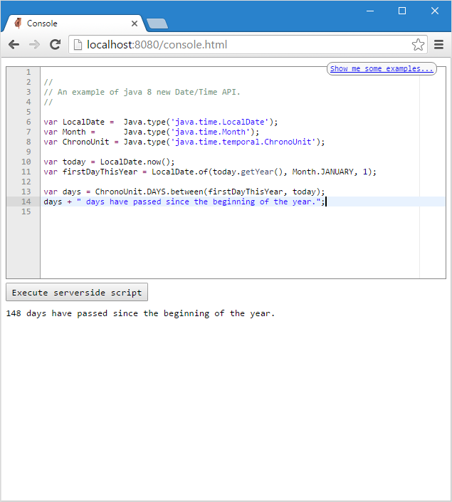

# nudge4j
Add a REPL to your java 8 application 

## Motivation:

To provide an environment for experimenting with code against a running application. You can write, run, and examine the results of code from a browser. A powerful alternative to debugging.

## Features:
- One line integration. ```nudge4j.HttpServer.start(8080);```
- No other dependencies
- Code Editor on the browser <a href='https://ace.c9.io'>Ace Editor</a> 
- Eval powered by nashorn

<a href='https://medium.com/@yolpogists/how-i-built-my-java-repl-61f66ed2ecee'>how-i-built-my-java-repl</a>

## In Action



nudge4j executes code written in javascript (<a href='http://www.oracle.com/technetwork/articles/java/jf14-nashorn-2126515.html'>nashorn</a>) and comes with an <a href='http://docs.oracle.com/javase/8/docs/jre/api/net/httpserver/spec/com/sun/net/httpserver/package-summary.html'>Http Server</a> and an <a href='https://ace.c9.io'>Ace Editor</a> to let code fly from the browser to any java application.


# download

Get the <a href='https://github.com/lorenzoongithub/nudge4j/blob/master/nudge4j/dist/nudge4j.jar?raw=true'>latest jar</a>

No other dependencies. 

*(Sorry, no maven yet. I will work on it)*

# get started

Add <a href='https://github.com/lorenzoongithub/nudge4j/blob/master/nudge4j/dist/nudge4j.jar?raw=true'>nudge4j.jar</a> to your classpath and call nudge4j from your code.

```java

import nudge4j.HttpServer;

public class YourProgram
{
   public static void main(String[] args) throws Exception
   {
       // This runs the nudge4j HTTP server on port 8080
       HttpServer.start(8080);
       
       // rest of the code
       // ...
   }
}
```

You can also pass objects to the javascript engine

```java

import java.util.HashMap; 
import java.io.File;  

import nudge4j.HttpServer;

public class YourProgram
{
   public static void main(String[] args) throws Exception
   {
       ...
       HashMap map = new HashMap();
       File file = new File("test");        
       ...
       // This runs the nudge4j HTTP server on port 8080
       // map   will be accessible as args[0]
       // file  will be accessible as args[1]
       HttpServer.start(8080,map,file);
       
       // rest of the code
       // ...
   }
}
```

If you don't fancy downloading the jar and changing your classpath - but still wish to try nudge4j - I might have a solution <a  href='http://nudge4j.appspot.com/onthecloud/index.html'>here</a>

# API - javadoc

The API consists of just one class <code>nudge4j.HttpServer</code>.
The javadoc is <a href='http://nudge4j.appspot.com/javadoc/index.html'>here</a>

# Examples

Copy/Paste the gists into nudge4j's web console

* <a href='https://gist.github.com/lorenzoongithub/127278b6478e9b35e3fca13b566f88b5'>local date</a> 
* <a href='https://gist.github.com/lorenzoongithub/01fdf87f9f1a4c60a41ba529d9cd534e'>threads</a> 
* <a href='https://gist.github.com/lorenzoongithub/5aa2f94967d261a447457500a7536f90'>lambda in Java 8</a> 
* <a href='https://gist.github.com/lorenzoongithub/d9964b85069fef1fd3794aa366d95a79'>memory</a>  
* <a href='https://gist.github.com/lorenzoongithub/dace58ea8dde941a21209c0fbba4561e'>PNG Encoder</a> requires okio.jar in your classpath

Please contact me if you have a gist you would like to add to the list above.

# Social Media

Twitter: <a href='https://twitter.com/nudge4jofficial'>nudge4j</a>
