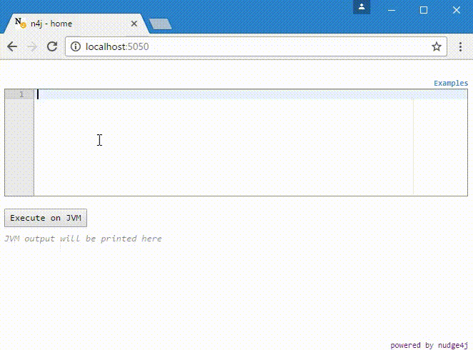

nudge4j
=======

nudge4j lets you control your java application from the browser, as if the browser was a smarter remote control.
It lets you send code from the browser to run on the JVM, hence providing you with an environment for experimenting with code. 
You can write, run, and examine the results of code from a browser.

To use nudge4j, there is nothing to download.
All you have to do is to add a tiny bit of java code in your program (e.g.: at the end of your main method) and get it executed.

See the <a href='https://lorenzoongithub.github.io/nudge4j/'>website</a> to get started.

nudge4j in action
-----------------

